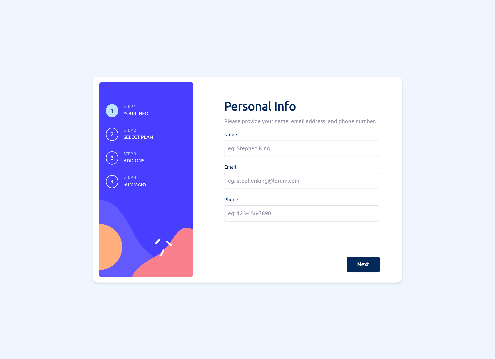
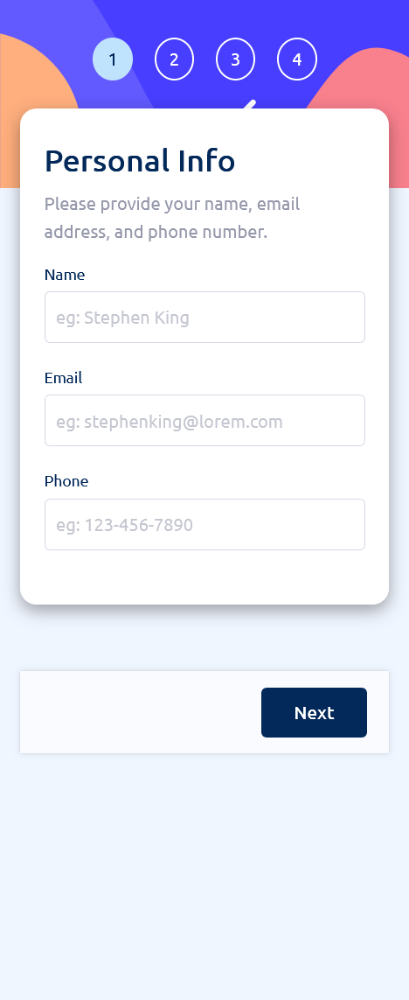

# Frontend Mentor - Multi-step form solution

This is a solution to the [Multi-step form challenge on Frontend Mentor](https://www.frontendmentor.io/challenges/multistep-form-YVAnSdqQBJ). Frontend Mentor challenges help you improve your coding skills by building realistic projects.

## Table of contents

- [Overview](#overview)
  - [The challenge](#the-challenge)
  - [Screenshot](#screenshot)
  - [Links](#links)
- [My process](#my-process)
  - [Built with](#built-with)
  - [What I learned](#what-i-learned)
  - [Continued development](#continued-development)
  - [Useful resources](#useful-resources)
- [Author](#author)
- [Acknowledgments](#acknowledgments)

## Overview

### The challenge

Users should be able to:

- Complete each step of the sequence
- Go back to a previous step to update their selections
- See a summary of their selections on the final step and confirm their order
- View the optimal layout for the interface depending on their device's screen size
- See hover and focus states for all interactive elements on the page
- Receive form validation messages if:
  - A field has been missed
  - The email address is not formatted correctly
  - A step is submitted, but no selection has been made

### Screenshot

### Links

- Solution URL: [Add solution URL here](https://your-solution-url.com)
- Live Site URL: [Add live site URL here](https://your-live-site-url.com)

## My process

- I started by creating the design of the form using the image provided in the challenge. I then created the HTML structure of the form and the different components of the form.
- After completing with the UI, I then added the functionality to the form using the context API to manage the state of the form and to pass the state to the different components of the form.

### Built with

- Semantic HTML5 markup
- CSS custom properties
- Flexbox
- CSS Grid
- Mobile-first workflow

### What I learned

- I learned how to use the context API to manage the state of the form. I used the context API to manage the state of the form and to pass the state to the different components of the form. I also learned how to use the context API to pass the state to the different components of the form.

### Continued development

- I would like to learn more about context API and how to use it in a real-world application.
- I am not yet comfortable with the context API and I would like to learn more about it.
- I will need to work on mobile responsiveness and make the form more responsive on mobile devices.

### Useful resources

- [Example resource 1](https://www.example.com)
- [Example resource 2](https://www.example.com)

## Author

- Website - [Add your name here](https://www.your-site.com)
- Frontend Mentor - [@AmanGupta1703](https://www.frontendmentor.io/profile/AmanGupta1703)
- Twitter - [@thekunalgupta17](https://www.twitter.com/thekunalgupta17)

## Acknowledgments
